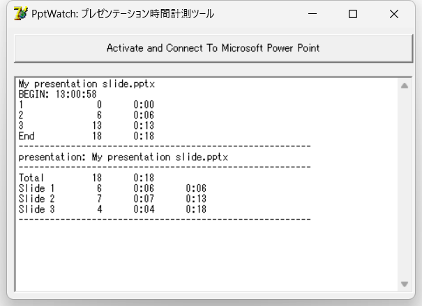

# PptWatch

This is a tool to monitor a PowerPoint presentation and measures the time spent on each slide.
1 to 2 slides per minute is a recommended style.  
If you spend too much time (e.g. two minutes) on a slide, you can break the slide into multiple slides.
If you spend only a few seconds on a slide, the slide may be merged to another slide.

The source code is written using Borland Delphi 7 on Windows XP and Office 2003.
Thank to the high compatibility of Windows and PowerPoint versions, the binary works for various versions of PowerPoint, e.g. PowerPoint 2019 on Windows 11.

## Uasge

Execute the tool and PowerPoint, and then start a presentation.
This tool records the timestamps of the presentation start and slide changes.
Please note that you must start the slideshow after the tool has started. 
If the tool is started later, the tool cannot recrd the slideshow.

When a presentation is terminated, the tool shows the total time and time spent for each slide.
The result is a table of tab-separated values.
Each line shows the following information.

> Slide Number[TAB]The number of seconds spent on the slide[TAB]The time in the mm:ss format[TAB]The accumulated time from the beginning

As the result ignores milliseconds, the total time may be slightly different from the time spent for each slide.

This tool may fail to connect to PowerPoint if multiple instances of PowerPoint exists.
Please confirm that the tool can measure the time by starting a presentation once before your actual practice.

The time measurement is finished if you terminate your presentation using an ESC key.
If you would like to include a demonstration of another application, please use ALT+TAB to switch to the application.

# PptWatch (The same explanation in Japanese)

PowerPoint で実行されたプレゼンテーションを観測し、スライドごとの使用時間を計測するツールです。
1分あたりスライド1から2枚程度というのが推奨されるスタイルの1つです。
長時間（たとえば2分間）スライドは、複数に分割することができます。
また、数秒しか費やしていないスライドは、他のスライドとまとめることができます。

Borland Delphi 7 を使って Windows XP, Office 2003 向けに開発したものです。
Windows と PowerPoint のバージョン間の互換性の高さのおかげで、多くのバージョン、たとえば Windows 11 上で動く Office 2019 に対しても動作します。

## Usage 

実行ファイルと Power Point を起動してスライドショーを開始してください。
このツールはスライドショー開始時点から時間計測を開始し、スライドを切り替えた時間を記録します。
スライドショーが終了した時点で、スライドショー全体の時間と、各スライドで費やした時間が集計され、一覧として出力されます．

出力される結果はタブ区切りになっており、各行は次のように構成されています。

> スライド番号[空白]スライドの秒数[空白]分・秒での表現[空白]１枚目からの累積時間

集計結果の表示ではミリ秒単位の情報は落としていますので、スライドごとの時間と累積時間は微妙に異なる場合があります。

複数の Power Point ファイルが同時に開かれている場合などに、PowerPoint への接続に失敗することがあるようです。
起動後、スライドショーを開始、終了して、結果が出力されていることを確認してから実際の発表練習などを開始してください。

スライドショーをESCで終了するとその時点で計測が停止してしまいます。別アプリケーションのデモなどをはさんでも時間計測を継続したい場合は、ALT+TAB を使ってプレゼンテーションを終了せずにデモを行ってください。
